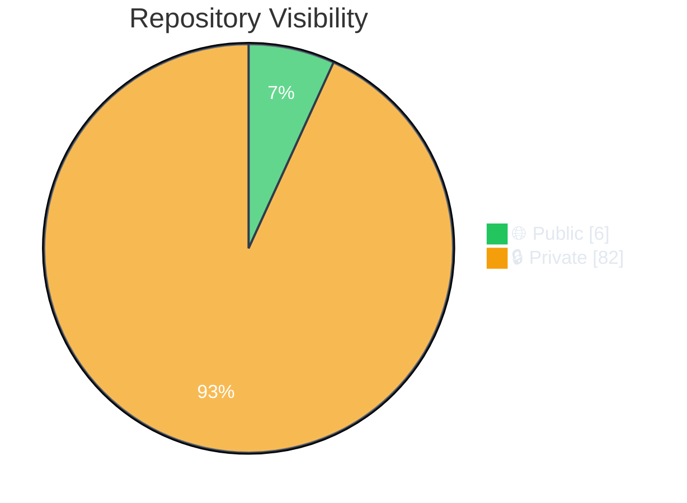
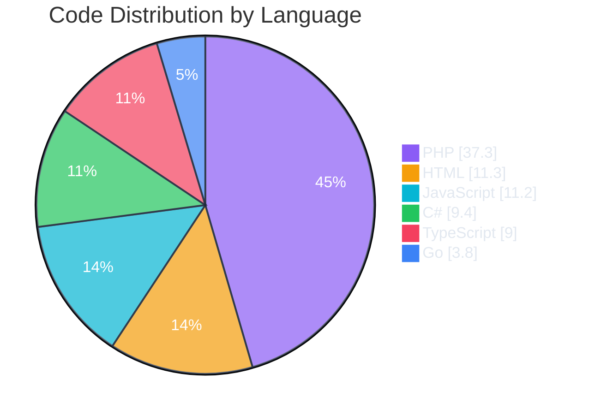
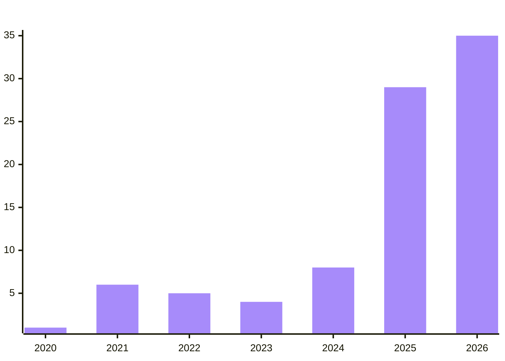
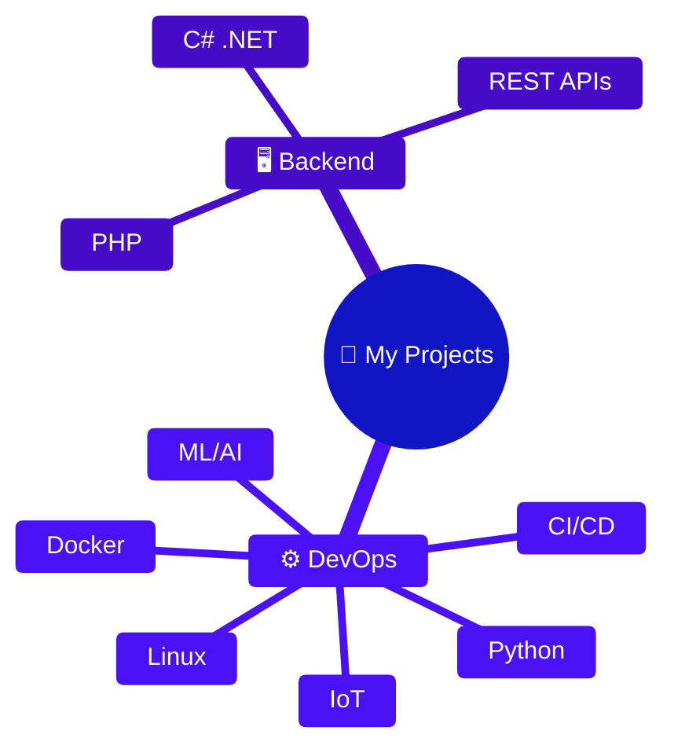

<div align="center">

<!-- Header Banner -->


<br>

[](https://github.com/polo-nyan)
[](https://github.com/polo-nyan)
[](https://github.com/polo-nyan)

</div>

## 👋 About Me

```yaml
name: ╲⧹ ⎛⎝ Marc ⎠⎞⧸╱
location: Germany 🇩🇪
role: Self-taught Hobby Developer
interests:
  - Backend Development
  - DevOps & Automation
  - Game Development
  - Machine Learning
currently_learning: [ML/AI, IoT]
fun_fact: Cat lover 🐱
```

---

## 🛠️ Tech Stack

<div align="center">

### 💪 Primary


### 🔧 Also Using


</div>

---

## 📊 GitHub Statistics

<!-- STATS-START -->

<div align="center">

### 📈 Overview

| 📁 Repositories | ⭐ Stars | 🍴 Forks | 💻 Top Language | 📦 Total Size |
|:---------------:|:-------:|:--------:|:---------------:|:-------------:|
| **88** | **0** | **0** | **PHP** | **1151.3 MB** |

</div>

---

### 📁 Repository Distribution

<div align="center">



</div>

<table align="center">
<tr>
<td align="center">

**📊 By Visibility**

| Type | Count |
|:-----|------:|
| 🌐 Public | 6 |
| 🔒 Private | 82 |

</td>
<td align="center">

**👤 By Owner**

| Type | Public | Private |
|:-----|-------:|--------:|
| Personal | 2 | 15 |
| Organization | 4 | 66 |

</td>
<td align="center">

**📋 By Status**

| Type | Count |
|:-----|------:|
| ✅ Active | 88 |
| 📦 Archived | 0 |
| 🔀 Original | 87 |
| 🍴 Forked | 1 |

</td>
</tr>
</table>

---

### 🔥 Activity & Commits

<div align="center">

<table>
<tr>
<td align="center">

**📝 Commit Stats**

| Metric | Value |
|:-------|------:|
| Total Commits | **580** |
| Avg per Repo | **20.0** |
| Median | **9** |

</td>
<td align="center">

**📜 Codebase Size**

| Metric | Value |
|:-------|------:|
| Est. Files | **~12848** |
| Est. Lines | **~3506272** |
| Avg Files/Repo | **146** |
| Avg Lines/File | **274** |

</td>
<td align="center">

**📅 Activity**

| Metric | Value |
|:-------|------:|
| Push Events (30d) | **41** |
| Avg Repo Age | **0.9 years** |

</td>
</tr>
</table>

</div>

---

### 💻 Languages by Code Volume

<div align="center">



</div>

<details>
<summary><b>📋 Detailed Language Breakdown</b></summary>

| Language | Percentage | Repositories |
|:---------|:----------:|:------------:|
| PHP | 37.3% | 31 |
| HTML | 11.3% | 32 |
| JavaScript | 11.2% | 32 |
| C# | 9.4% | 27 |
| TypeScript | 9.0% | 8 |
| Go | 3.8% | 2 |
| CSS | 3.7% | 28 |
| Shell | 3.1% | 38 |
| Svelte | 2.5% | 1 |
| Python | 2.3% | 7 |

</details>

---

### ⭐ Notable Public Projects


<details>
<summary><b>🔄 Recently Updated (Public)</b></summary>

| Repository | Last Updated |
|:-----------|:------------:|
| [polo-nyan](https://github.com/polo-nyan/polo-nyan) | 2026-06-11 |
| [web-core](https://github.com/smol-kitten/web-core) | 2026-06-05 |
| [common-ressources](https://github.com/smol-kitten/common-ressources) | 2026-05-30 |
| [Twitch-Channel-Points-Miner-v2.1](https://github.com/polo-nyan/Twitch-Channel-Points-Miner-v2.1) | 2026-05-23 |
| [MinecraftThroughTime](https://github.com/smol-kitten/MinecraftThroughTime) | 2026-03-14 |

</details>

---

### 📅 Repository Creation Timeline

<div align="center">



</div>

---

### 🎯 Development Focus

<div align="center">



</div>

---

## 🔗 Connect

<div align="center">

[](https://github.com/polo-nyan)
[](https://github.com/smol-kitten)

</div>

---

<details>
<summary><b>📋 Note on Profile Status</b></summary>

<br>

> **⚠️ Contingency Notice**
>
> This GitHub profile is actively maintained using a self-hosted GitHub Actions runner.
> In case of any of the following situations:
> - Self-hosted runner costs
> - Technical issues with the automation pipeline
> - Changes to GitHub's API or policies
>
> This profile may transition to become an **inactive mirror** of a private
> [Gitea](https://gitea.io) instance where active development continues.
>
> If you notice the stats haven't updated in a while, development is likely
> continuing on the private instance. Feel free to reach out!

</details>

---

<div align="center">

| 📊 Quick Stats | |
|:---|:---|
| 📁 Total Repos | **88** (6 public, 82 private) |
| 💾 Code Volume | **1151.3 MB** across 87 projects |
| 💻 Top Language | **PHP** |
| 📅 Last Updated | **2026-06-12** |

<br>

<sub>🤖 Auto-generated daily via GitHub Actions on self-hosted runner</sub>
<br>
<sub>🔒 Private project names are never exposed</sub>

<br><br>


</div>
<!-- STATS-END -->
